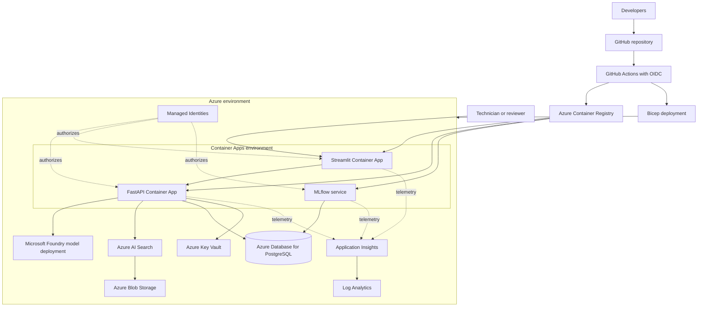

# Azure Architecture

## Goal

The Azure deployment provides a production-like environment for the portfolio system while preserving the MVP safety boundary: the copilot reads synthetic operational data and creates reviewable proposals, but does not control industrial equipment.

## Target architecture

## Resource responsibilities

### Azure Container Registry

- stores versioned API, frontend, and optional MLflow images
- provides an immutable image reference for promotion and rollback
- is accessed from deployment workflows and Container Apps using scoped identities

### Azure Container Apps

- runs the FastAPI and Streamlit containers
- supports environment-specific configuration, revisions, health probes, and scaling
- keeps API and frontend independently deployable
- does not embed secrets in images

### Microsoft Foundry model deployment

- supplies the language model used by the agent
- is accessed through a provider adapter
- does not receive database credentials or direct write permissions
- has deployment name and model version recorded in traces and evaluation results

### Azure AI Search

- stores searchable document chunks and metadata
- supports hybrid keyword and vector retrieval
- filters on machine type, document type, approval status, and revision
- is not treated as the authoritative copy of the original document

### Azure Database for PostgreSQL

- stores machines, sensor readings, maintenance, incidents, sessions, feedback, approvals, and work-order records
- uses versioned migrations
- is accessed through bounded repositories and tools

### Azure Blob Storage

- stores source documents and ingestion artifacts
- provides the authoritative document object referenced by indexed metadata
- uses explicit version and retention policies before production use

### Azure Key Vault

- stores secrets that cannot be replaced by managed identity
- is accessed through scoped identity
- does not act as general application configuration storage

### Application Insights and Log Analytics

- collect operational traces, logs, metrics, failures, and dependency timings
- exclude secrets and hidden chain-of-thought
- complement MLflow, which focuses on agent traces and evaluation

### MLflow

- records agent traces, evaluation runs, scorers, datasets, and quality metrics
- may use managed storage or a separately secured backing store in a later design
- is optional in the smallest demo deployment but required by Definition of Done

## Identity and trust

- GitHub Actions authenticates to Azure with OpenID Connect.
- Container Apps use managed identities.
- Each component receives separate, least-privilege role assignments.
- The API identity receives only the data-plane access required for Search, Blob, Key Vault, and the model endpoint.
- Database credentials, when required, are retrieved securely and never committed.
- Production approval is enforced through a protected GitHub environment.

## Environment separation

The design supports:

- local
- dev
- staging
- production

Each deployed environment has separate configuration and should use separate:

- Container Apps revisions or resources
- database and credentials
- search index
- document storage scope
- model deployment configuration
- telemetry and evaluation records

Production data or credentials must not be copied into lower environments.

## Network posture

The first portfolio deployment may use public endpoints with authentication and strict access control. A later hardening step can introduce private endpoints, virtual network integration, and restricted ingress. The chosen posture must be documented per environment before deployment.

## Deployment flow

```mermaid
flowchart LR
    PR[Pull request] --> Validate[Lint, types, tests, PR eval, scans]
    Validate --> Main[Merge to main]
    Main --> FullEval[Full tests and evaluation]
    FullEval --> Build[Build versioned images and SBOM]
    Build --> Push[Push to ACR]
    Push --> Dev[Deploy dev or staging revision]
    Dev --> Smoke[Smoke tests]
    Smoke --> Approval[Protected production approval]
    Approval --> Prod[Deploy production revision]
    Prod --> Verify[Post-deployment verification]
    Verify --> Monitor[Monitor]
    Monitor -->|Failure| Rollback[Route to previous verified revision]
```

## Infrastructure as Code

Bicep modules define:

- container registry
- Container Apps environment and applications
- AI Search
- PostgreSQL
- Key Vault
- Blob Storage
- Application Insights
- Log Analytics
- managed identities
- role assignments

Environment parameter files contain non-secret environment-specific values. Deployment credentials and application secrets are never placed in parameter files committed to Git.

## Availability and failure behavior

- API readiness reflects critical dependencies.
- Model, search, and database calls use explicit timeouts and bounded retries.
- Search unavailability results in a degraded response without document claims.
- Database unavailability blocks database-backed evidence and all write workflows.
- MLflow or dashboard failure should not fabricate or alter a diagnostic result.
- A failed deployment retains or restores the previous verified revision.

## Cost controls

- use scale-to-zero or minimum replicas appropriate to the environment
- cap evaluation and model workloads in pull requests
- record model tokens and estimated cost
- apply retention policies to logs, traces, documents, and evaluation artifacts
- use resource tags for environment, owner, project, and cost tracking

## Open deployment decisions

The following details are intentionally deferred until the infrastructure phase:

- exact Azure regions and service tiers
- private networking requirements
- production authentication provider
- MLflow backing-store topology
- backup and disaster-recovery targets
- environment-specific scaling limits

These decisions require cost, quota, and deployment-context information not available during phase 0.
