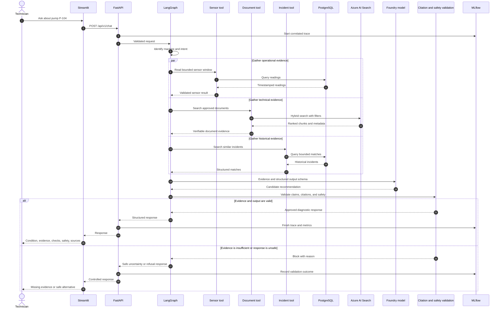
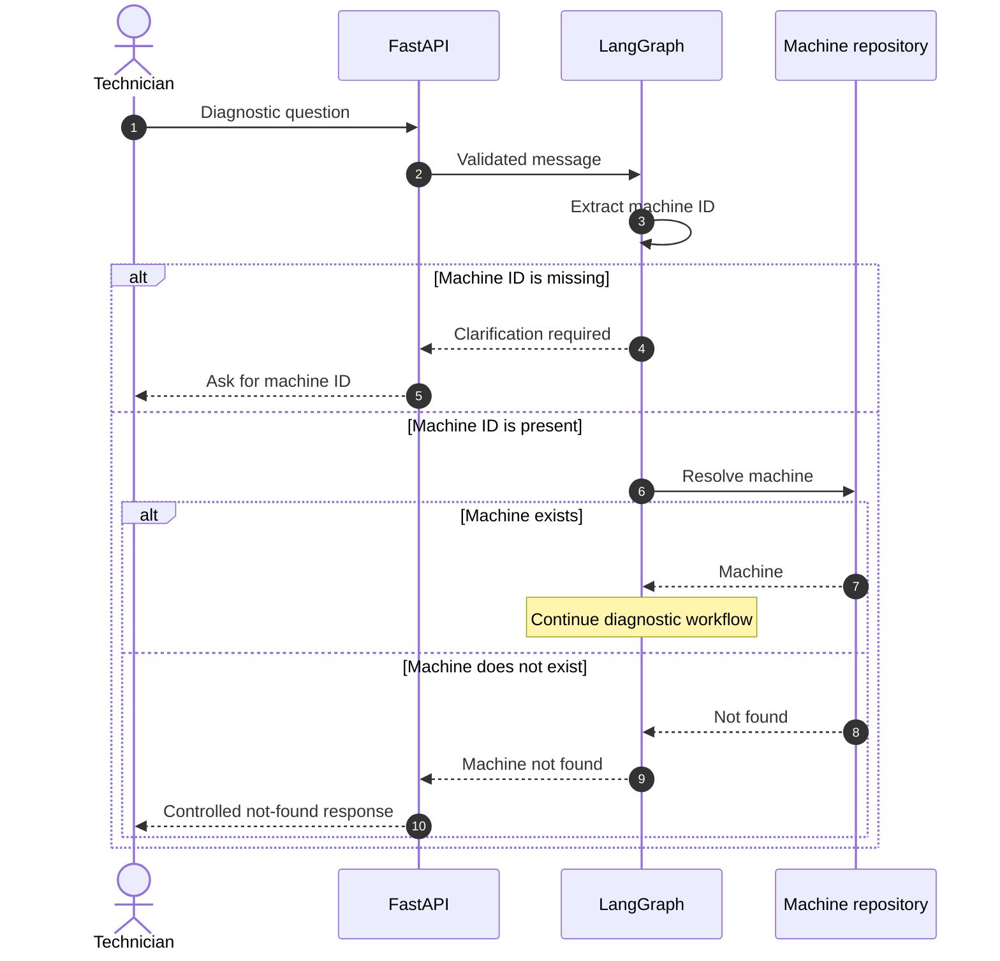
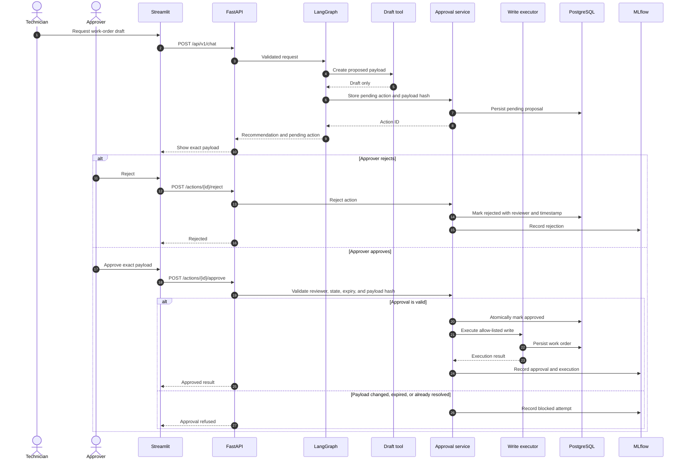
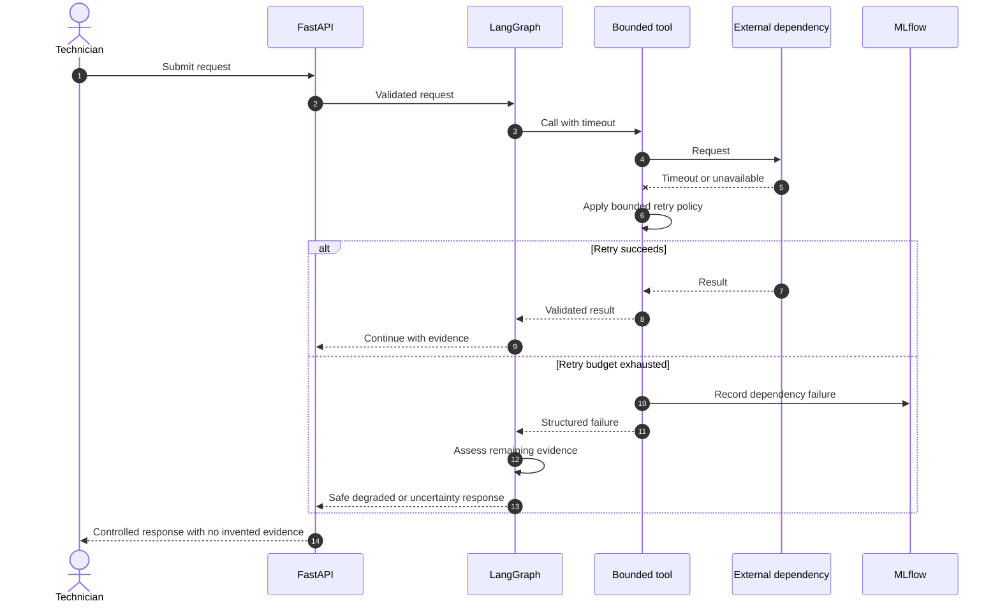
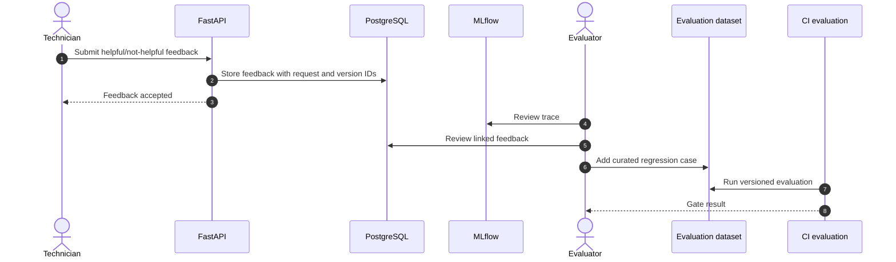

# Sequence Diagrams

## Diagnostic request

```mermaid
sequenceDiagram
    autonumber
    actor Technician
    participant UI as Streamlit
    participant API as FastAPI
    participant Agent as LangGraph
    participant Sensor as Sensor tool
    participant Docs as Document tool
    participant Incidents as Incident tool
    participant DB as PostgreSQL
    participant Search as Azure AI Search
    participant Model as Foundry model
    participant Safety as Citation and safety validation
    participant Trace as MLflow

    Technician->>UI: Ask about pump P-104
    UI->>API: POST /api/v1/chat
    API->>Trace: Start correlated trace
    API->>Agent: Validated request
    Agent->>Agent: Identify machine and intent

    par Gather operational evidence
        Agent->>Sensor: Read bounded sensor window
        Sensor->>DB: Query readings
        DB-->>Sensor: Timestamped readings
        Sensor-->>Agent: Validated sensor result
    and Gather technical evidence
        Agent->>Docs: Search approved documents
        Docs->>Search: Hybrid search with filters
        Search-->>Docs: Ranked chunks and metadata
        Docs-->>Agent: Verifiable document evidence
    and Gather historical evidence
        Agent->>Incidents: Search similar incidents
        Incidents->>DB: Query bounded matches
        DB-->>Incidents: Historical incidents
        Incidents-->>Agent: Structured matches
    end

    Agent->>Model: Evidence and structured output schema
    Model-->>Agent: Candidate recommendation
    Agent->>Safety: Validate claims, citations, and safety

    alt Evidence and output are valid
        Safety-->>Agent: Approved diagnostic response
        Agent-->>API: Structured response
        API->>Trace: Finish trace and metrics
        API-->>UI: Response
        UI-->>Technician: Condition, evidence, checks, safety, sources
    else Evidence is insufficient or response is unsafe
        Safety-->>Agent: Block with reason
        Agent-->>API: Safe uncertainty or refusal response
        API->>Trace: Record validation outcome
        API-->>UI: Controlled response
        UI-->>Technician: Missing evidence or safe alternative
    end
```

## Missing or unknown machine

```mermaid
sequenceDiagram
    autonumber
    actor Technician
    participant API as FastAPI
    participant Agent as LangGraph
    participant Machines as Machine repository

    Technician->>API: Diagnostic question
    API->>Agent: Validated message
    Agent->>Agent: Extract machine ID

    alt Machine ID is missing
        Agent-->>API: Clarification required
        API-->>Technician: Ask for machine ID
    else Machine ID is present
        Agent->>Machines: Resolve machine
        alt Machine exists
            Machines-->>Agent: Machine
            Note over Agent: Continue diagnostic workflow
        else Machine does not exist
            Machines-->>Agent: Not found
            Agent-->>API: Machine not found
            API-->>Technician: Controlled not-found response
        end
    end
```

## Work-order draft and approval

```mermaid
sequenceDiagram
    autonumber
    actor Technician
    actor Approver
    participant UI as Streamlit
    participant API as FastAPI
    participant Agent as LangGraph
    participant Draft as Draft tool
    participant Approval as Approval service
    participant Write as Write executor
    participant DB as PostgreSQL
    participant Trace as MLflow

    Technician->>UI: Request work-order draft
    UI->>API: POST /api/v1/chat
    API->>Agent: Validated request
    Agent->>Draft: Create proposed payload
    Draft-->>Agent: Draft only
    Agent->>Approval: Store pending action and payload hash
    Approval->>DB: Persist pending proposal
    Approval-->>Agent: Action ID
    Agent-->>API: Recommendation and pending action
    API-->>UI: Show exact payload

    alt Approver rejects
        Approver->>UI: Reject
        UI->>API: POST /actions/{id}/reject
        API->>Approval: Reject action
        Approval->>DB: Mark rejected with reviewer and timestamp
        Approval->>Trace: Record rejection
        API-->>UI: Rejected
    else Approver approves
        Approver->>UI: Approve exact payload
        UI->>API: POST /actions/{id}/approve
        API->>Approval: Validate reviewer, state, expiry, and payload hash
        alt Approval is valid
            Approval->>DB: Atomically mark approved
            Approval->>Write: Execute allow-listed write
            Write->>DB: Persist work order
            Write-->>Approval: Execution result
            Approval->>Trace: Record approval and execution
            API-->>UI: Approved result
        else Payload changed, expired, or already resolved
            Approval->>Trace: Record blocked attempt
            API-->>UI: Approval refused
        end
    end
```

## Dependency failure

```mermaid
sequenceDiagram
    autonumber
    actor Technician
    participant API as FastAPI
    participant Agent as LangGraph
    participant Tool as Bounded tool
    participant Dependency as External dependency
    participant Trace as MLflow

    Technician->>API: Submit request
    API->>Agent: Validated request
    Agent->>Tool: Call with timeout
    Tool->>Dependency: Request
    Dependency--xTool: Timeout or unavailable
    Tool->>Tool: Apply bounded retry policy

    alt Retry succeeds
        Dependency-->>Tool: Result
        Tool-->>Agent: Validated result
        Agent-->>API: Continue with evidence
    else Retry budget exhausted
        Tool->>Trace: Record dependency failure
        Tool-->>Agent: Structured failure
        Agent->>Agent: Assess remaining evidence
        Agent-->>API: Safe degraded or uncertainty response
    end

    API-->>Technician: Controlled response with no invented evidence
```

## Feedback to regression test

```mermaid
sequenceDiagram
    autonumber
    actor Technician
    participant API as FastAPI
    participant DB as PostgreSQL
    participant MLflow
    actor Evaluator
    participant Dataset as Evaluation dataset
    participant CI as CI evaluation

    Technician->>API: Submit helpful/not-helpful feedback
    API->>DB: Store feedback with request and version IDs
    API-->>Technician: Feedback accepted
    Evaluator->>MLflow: Review trace
    Evaluator->>DB: Review linked feedback
    Evaluator->>Dataset: Add curated regression case
    CI->>Dataset: Run versioned evaluation
    CI-->>Evaluator: Gate result
```
