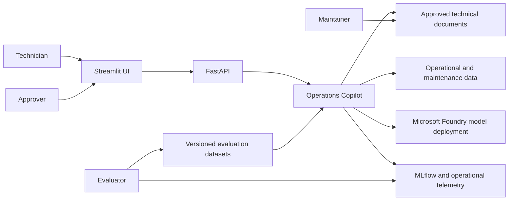
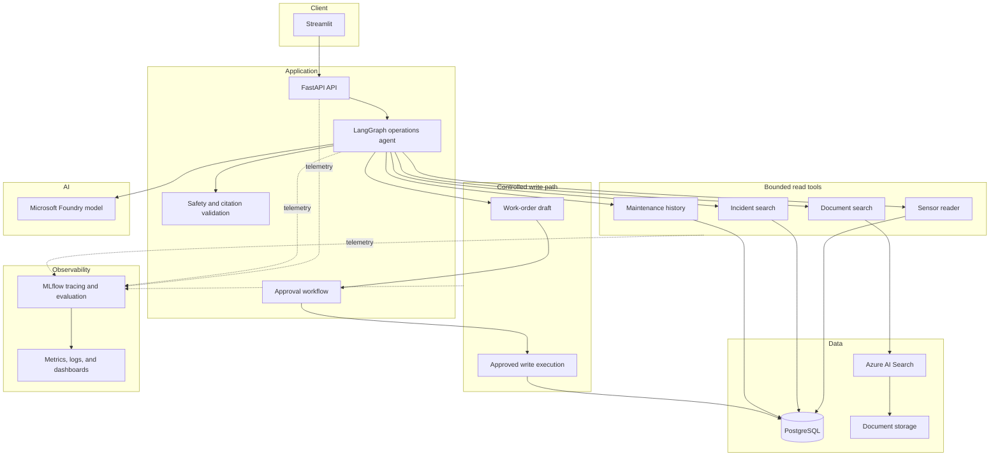

# System Overview

## Context

Industrial AI Operations Copilot supports a technician who is troubleshooting a centrifugal pump. It gathers evidence from technical documents, simulated sensor readings, maintenance history, and historical incidents, then produces a structured recommendation. The system is diagnostic decision support; it is not a control system.

## System context

## Logical component architecture

## Component responsibilities

### Streamlit UI

- selects a machine and submits questions
- displays sensor status, evidence, recommendations, and safety notices
- displays the exact payload for approval or rejection
- collects helpful/not-helpful feedback
- does not contain business-critical authorization logic

### FastAPI

- validates external contracts
- creates request and session identifiers
- exposes chat, streaming, status, session, approval, feedback, health, and readiness endpoints
- maps internal failures to safe API responses
- delegates diagnostic decisions to the application layer

### LangGraph operations agent

- validates that required context exists
- identifies intent and required evidence
- chooses bounded tools
- assesses evidence
- generates structured candidate output
- routes output through citation and safety validation
- stops on insufficient evidence or unsafe requests

### Tools

Tools are application capabilities with typed input, typed output, limits, timeouts, and tracing. They are not arbitrary code execution interfaces.

- document search reads approved indexed content
- sensor reader reads bounded time windows
- incident search returns bounded historical matches
- maintenance history returns recent records
- work-order draft produces a proposed payload only

### Safety and approval

- verifies that cited evidence exists
- enforces safety policy
- keeps observations separate from hypotheses
- persists proposed actions as pending
- executes a write only after valid, payload-bound approval

### Data services

- Azure AI Search serves hybrid document retrieval
- PostgreSQL stores operational records, sessions, feedback, and approval state
- document storage retains source documents used for indexing

### Model runtime

The Microsoft Foundry-hosted model interprets requests and produces structured candidates. It is not the source of truth and cannot bypass tool, citation, safety, or approval validation.

### Observability and evaluation

- MLflow records agent and tool traces and evaluation results
- operational telemetry records service health, latency, failures, and cost
- dashboards present aggregated metrics without exposing hidden reasoning

## Trust boundaries

1. **User to API** — all input is untrusted and validated.
2. **Documents to retrieval pipeline** — document content may contain malformed or adversarial text.
3. **Model output to application** — all model output is untrusted until schema, citation, and safety validation passes.
4. **Agent to tools** — only allow-listed, typed tools are callable.
5. **Proposal to execution** — approval is a mandatory authorization boundary.
6. **Application to Azure services** — access uses managed identity and least privilege.

## Deployment modes

### Local

- FastAPI
- Streamlit
- PostgreSQL
- MLflow
- optional Redis and local dashboard
- mock model and retrieval adapters for deterministic tests

### Azure

- Azure Container Apps for API and frontend
- Azure Container Registry
- Azure AI Search
- Azure Database for PostgreSQL
- Azure Blob Storage
- Azure Key Vault
- Microsoft Foundry model deployment
- Application Insights and Log Analytics

## Key constraints

- only centrifugal pumps are supported in the MVP
- all operational data is synthetic
- the system never controls real equipment
- a work order remains a draft unless an explicitly approved write integration is later enabled
- all quality claims must identify the evaluation dataset and environment used
