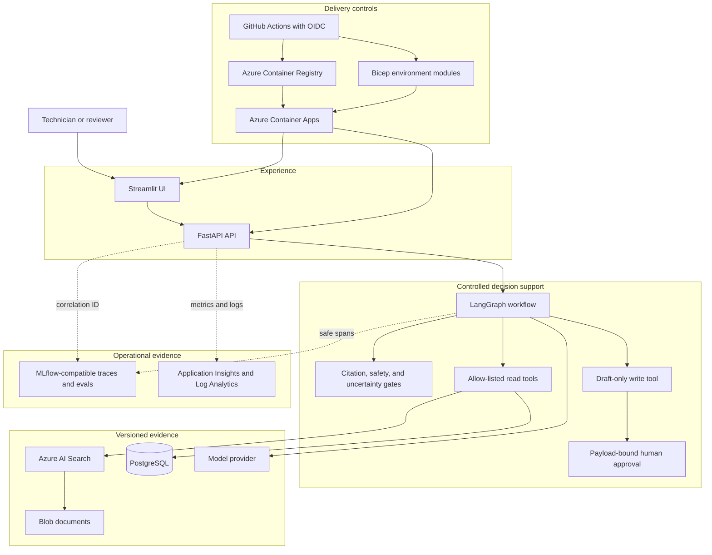
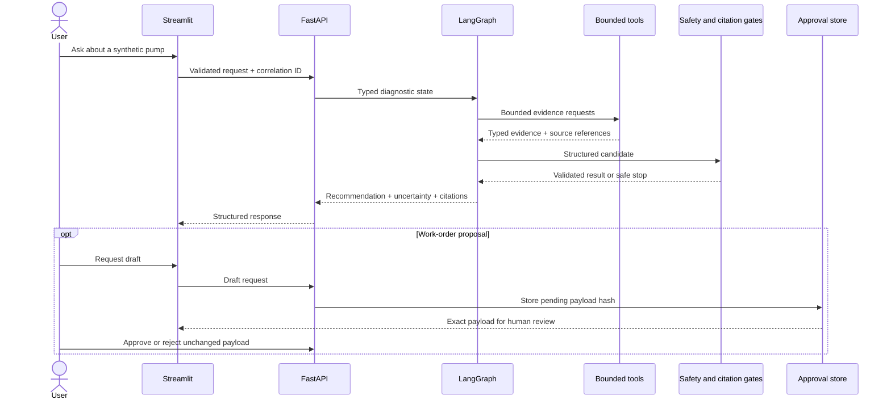

# Portfolio architecture

This view connects the local demo, application boundaries, Azure resources, and
delivery controls. Detailed component responsibilities remain in the
[system overview](../architecture/system-overview.md).

## Request and approval sequence

## Trust and failure boundaries

1. User, document, and model content is untrusted until validated.
2. The agent has no generic SQL or arbitrary execution capability.
3. Read and write paths are separate; draft creation is not execution.
4. Approval binds actor, payload hash, expiry, and one-time state transition.
5. External calls have bounded timeout, attempts, backoff, and circuit state.
6. Cache and observability are optional; their failure cannot fabricate or
   suppress the core diagnostic result.
7. Database and required evidence dependencies affect readiness, while liveness
   remains a process-level signal.

## Deployment modes

| Mode | Runtime | Evidence claim |
| --- | --- | --- |
| Local | Docker Compose, mock adapters, synthetic PostgreSQL data | Reproducible product walkthrough without paid services |
| CI | PostgreSQL service, deterministic evaluation and static checks | Contract, quality, safety, and release-gate evidence |
| Azure | Bicep, Container Apps, managed identity, data and monitoring services | Declared deployment design; live status requires retained deployment artifacts |
