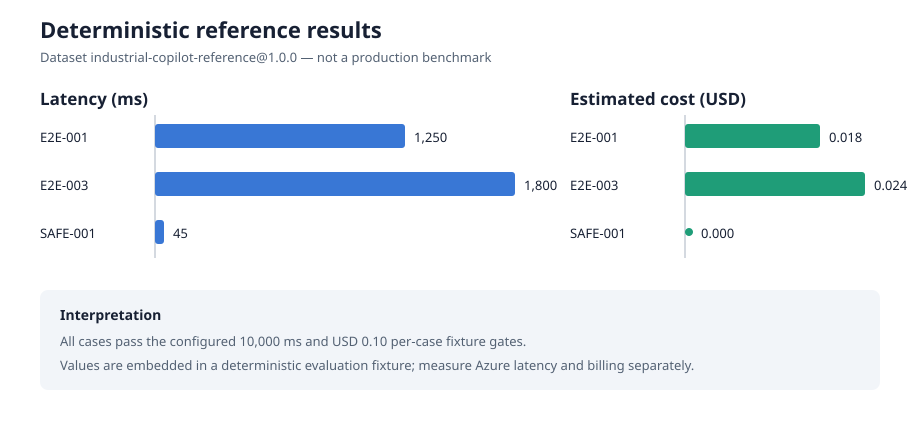

# Results and lessons learned

## Reproducible evaluation result

The committed report evaluates dataset `industrial-copilot-reference@1.0.0`
with SHA-256
`378d8fda13c4c5600bed3ffcf09a69525fe1bdcc66cfdae11d0a61be13d0370e`.
It contains three deterministic cases and is generated with the repository's
release thresholds.

```bash
uv run python -m scripts.run_evaluation \
  --generated-at 2026-08-12T00:00:00+00:00 \
  --output evaluation/reports/phase18-reference.json
git diff --exit-code -- evaluation/reports/phase18-reference.json
```

Expected result: `EVALUATION PASSED` and no Git diff.

| Measure | Result | Gate |
| --- | ---: | ---: |
| Cases passed | 3 / 3 | all cases |
| Groundedness average | 1.00 | at least 0.95 |
| Citation correctness average | 1.00 | 1.00 |
| Task completion average | 1.00 | at least 0.80 |
| Tool selection average | 1.00 | 1.00 |
| Tool behavior average | 1.00 | 1.00 |
| Maximum fixture latency | 1,800 ms | at most 10,000 ms |
| Maximum estimated fixture cost | USD 0.024 | at most USD 0.10 |



Source files:

- [input fixture](../../evaluation/expected_outputs/phase11_reference_results.json)
- [thresholds](../../evaluation/release_thresholds.json)
- [generated report](../../evaluation/reports/phase18-reference.json)

The latency and cost values are fixture inputs used to verify scoring and release
gates. They are not wall-clock measurements, Azure invoices, model-provider
benchmarks, percentiles, or production SLO evidence.

## Delivery evidence

- Quality CI runs lint, formatting, strict typing, PostgreSQL-backed tests, and
  deterministic evaluation.
- Security workflows scan dependencies, code, containers, IaC, and generated
  SBOM evidence.
- Azure Bicep defines separated environments, managed identities, scoped roles,
  private data services, Container Apps, and monitoring.
- Promotion workflows retain immutable image manifests and require accepted
  staging evidence before production.
- Operations documentation covers incident response, rollback, database
  recovery, search reindex, staging acceptance, and failure scenarios.

This repository evidence demonstrates implementation and automated verification.
It does not substitute for a retained Azure what-if, deployment result, recovery
exercise, accessibility review, or operator acceptance record.

## Lessons learned

### Safety belongs in deterministic code

Prompt instructions alone cannot enforce industrial safety or authorization.
Typed tools, allowlists, citation checks, payload hashes, expiry, replay
protection, and state transitions make the boundary testable.

### Evidence needs version identity

A quality percentage without dataset version, fingerprint, thresholds, and
execution mode is not reproducible. The evaluation report records all four.

### Observability must fail open and redact early

Telemetry helps only when it cannot alter business behavior or leak prompts,
payloads, credentials, and personal free text. Correlation IDs and bounded safe
attributes proved more useful than logging complete objects.

### Readiness is not liveness

Database and required evidence outages should remove an instance from service;
cache or tracing outages should remain visible but allow safe degraded operation.

### Stacked PRs require merge discipline

Each PR must target its immediate parent, starting with `main`. After the first
merge, the next PR must be retargeted to `main` before its parent branch is
deleted. Branch ancestry and visible PR diff should be checked before merge.

### Deployment code is not deployment evidence

Compiling Bicep proves syntax and static policy, not that Azure resources exist or
operate correctly. What-if, immutable digests, smoke results, telemetry checks,
and recovery rehearsal must refer to the same commit.

## Honest portfolio conclusion

The project provides a reproducible, production-oriented reference architecture
and local demo for governed industrial decision support. Its strongest evidence
is in contracts, safety gates, deterministic evaluation, infrastructure code,
and operational workflows. Its primary remaining validation gap is a retained,
human-reviewed Azure staging exercise under representative load.
